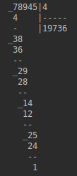

# Integer Long Division Eurasian Style

## Description

- This is Java application that divides integer numbers, and prints process and results in long division algorithm 
into the console. The long division algorithm will be in Eurasian style. 

>_Dividend must be integer and non-negative number._
>_Divisor must be integer and greater than null number._

## Example:

- Dividend is 78945 and divisor is 4:

- 

## Usage

- In the root folder of this project enter command to build project:

> mvn clean package

- To execute in the root folder of this project enter command:

> java -jar target/LongDivisionEurasianStyle.jar
